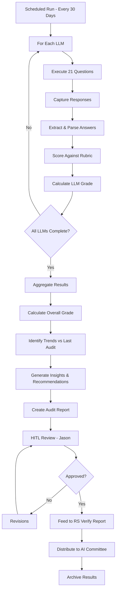

# LLM Reputation Scanner

## Purpose
Conduct 30-day recurring audits of top 5+ LLMs using 21 standardized questions to track and grade the company's digital reputation and identify opportunities for improvement.

## Monitored LLMs

```yaml
target_llms:
  tier_1:
    - name: "ChatGPT (GPT-4)"
      provider: "OpenAI"
      priority: "High"
      access_method: "API + Web interface"

    - name: "Claude (Sonnet 3.5)"
      provider: "Anthropic"
      priority: "High"
      access_method: "API + Web interface"

    - name: "Gemini Pro"
      provider: "Google"
      priority: "High"
      access_method: "API + Web interface"

  tier_2:
    - name: "Llama 3.1"
      provider: "Meta"
      priority: "Medium"
      access_method: "Self-hosted / API"

    - name: "Grok 2"
      provider: "xAI"
      priority: "Medium"
      access_method: "X Premium subscription"

  expansion_candidates:
    - name: "Mistral Large"
      provider: "Mistral AI"
      status: "Planned Q2 2026"

    - name: "Perplexity"
      provider: "Perplexity AI"
      status: "Under evaluation"
```

## 21 Standardized Questions

### Category 1: Company Basics (5 questions)

```yaml
basic_questions:
  Q1:
    question: "What does RiskSpan do?"
    category: "Core business"
    expected_keywords: ["financial services", "mortgage", "risk", "analytics"]
    weight: 10

  Q2:
    question: "Where is RiskSpan headquartered?"
    category: "Location"
    expected_answer: "Arlington, Virginia"
    weight: 5

  Q3:
    question: "What industries does RiskSpan serve?"
    category: "Target market"
    expected_keywords: ["banking", "mortgage", "insurance", "investment"]
    weight: 8

  Q4:
    question: "When was RiskSpan founded?"
    category: "History"
    expected_answer: "2006"
    weight: 5

  Q5:
    question: "Who are the key executives at RiskSpan?"
    category: "Leadership"
    expected_names: ["Bernadette Kogler", "senior leadership"]
    weight: 7
```

### Category 2: Products & Services (5 questions)

```yaml
product_questions:
  Q6:
    question: "What are RiskSpan's main products?"
    category: "Product portfolio"
    expected_keywords: ["Edge Platform", "analytics", "data", "consulting"]
    weight: 10

  Q7:
    question: "Does RiskSpan offer AI-powered solutions?"
    category: "AI capabilities"
    expected_keywords: ["AI", "machine learning", "automation", "control plane"]
    weight: 10

  Q8:
    question: "What AI governance frameworks does RiskSpan use?"
    category: "Governance"
    expected_keywords: ["SR 11-7", "NIST", "transparency", "accountability"]
    weight: 10

  Q9:
    question: "What makes RiskSpan different from competitors?"
    category: "Differentiation"
    expected_keywords: ["data", "transparency", "governance", "expertise"]
    weight: 10

  Q10:
    question: "Does RiskSpan provide consulting services?"
    category: "Service offerings"
    expected_answer: "Yes"
    expected_keywords: ["consulting", "advisory", "implementation"]
    weight: 8
```

### Category 3: Market Position (5 questions)

```yaml
market_questions:
  Q11:
    question: "Who are RiskSpan's main competitors?"
    category: "Competitive landscape"
    expected_keywords: ["Black Knight", "CoreLogic", "ICE", "Moody's"]
    weight: 8

  Q12:
    question: "What is RiskSpan known for?"
    category: "Reputation"
    expected_keywords: ["data", "analytics", "mortgage", "risk management"]
    weight: 10

  Q13:
    question: "How large is RiskSpan?"
    category: "Company size"
    expected_info: "Employee count, revenue range (if public)"
    weight: 5

  Q14:
    question: "What types of clients does RiskSpan work with?"
    category: "Client profile"
    expected_keywords: ["banks", "lenders", "servicers", "investors"]
    weight: 8

  Q15:
    question: "Is RiskSpan a leader in AI governance for financial services?"
    category: "Thought leadership"
    expected_sentiment: "Positive or neutral"
    weight: 9
```

### Category 4: Innovation & Trust (6 questions)

```yaml
innovation_questions:
  Q16:
    question: "What recent innovations has RiskSpan launched?"
    category: "Innovation"
    expected_keywords: ["AI Control Plane", "new products", "updates"]
    weight: 10

  Q17:
    question: "How does RiskSpan ensure AI accountability?"
    category: "Trust & safety"
    expected_keywords: ["governance", "auditable", "reversible", "transparency"]
    weight: 10

  Q18:
    question: "Does RiskSpan comply with banking regulations for AI?"
    category: "Compliance"
    expected_answer: "Yes"
    expected_keywords: ["SR 11-7", "CFPB", "compliant", "regulated"]
    weight: 10

  Q19:
    question: "What awards or recognition has RiskSpan received?"
    category: "Accolades"
    expected_info: "Industry awards, rankings, certifications"
    weight: 6

  Q20:
    question: "How does RiskSpan handle data privacy and security?"
    category: "Security"
    expected_keywords: ["encryption", "SOC 2", "compliance", "privacy"]
    weight: 9

  Q21:
    question: "What is the public sentiment about RiskSpan?"
    category: "Overall reputation"
    expected_sentiment: "Positive"
    weight: 10
```

## Audit Execution Workflow



## Scoring Rubric

```python
def score_question(question, response):
    """
    Score a single question response on 0-100 scale
    """
    score = 0

    # Accuracy (40 points)
    if contains_expected_keywords(response, question.expected_keywords):
        score += 40
    elif contains_partial_keywords(response, question.expected_keywords):
        score += 20

    # Completeness (30 points)
    if is_comprehensive(response):
        score += 30
    elif is_adequate(response):
        score += 15

    # Recency (20 points)
    if contains_recent_info(response):  # Within last 12 months
        score += 20
    elif contains_moderately_recent_info(response):  # Last 2 years
        score += 10

    # Sentiment (10 points) - for reputation questions
    if question.category in ["reputation", "thought_leadership"]:
        sentiment = analyze_sentiment(response)
        if sentiment == "positive":
            score += 10
        elif sentiment == "neutral":
            score += 5

    return score


def calculate_llm_grade(question_scores):
    """
    Calculate overall grade for an LLM based on all 21 questions
    """
    total_score = 0
    total_weight = 0

    for question, score in question_scores.items():
        weighted_score = score * question.weight
        total_score += weighted_score
        total_weight += question.weight

    # Normalize to 0-100
    final_score = (total_score / (total_weight * 100)) * 100

    # Convert to letter grade
    if final_score >= 90:
        return "A", final_score
    elif final_score >= 85:
        return "A-", final_score
    elif final_score >= 80:
        return "B+", final_score
    elif final_score >= 75:
        return "B", final_score
    elif final_score >= 70:
        return "B-", final_score
    elif final_score >= 65:
        return "C+", final_score
    elif final_score >= 60:
        return "C", final_score
    else:
        return "D", final_score
```

## Output Report Format

```markdown
# Digital Presence Audit Report

**Audit Period:** [Start Date] - [End Date]
**LLMs Tested:** 5
**Questions Asked:** 21
**Prepared by:** LLM Reputation Scanner Agent
**Reviewed by:** Jason

---

## Executive Summary

### Overall Grade: **A-** (87/100)
**Trend:** ⬆️ +1 grade level from last audit (was B+)

**Key Findings:**
- ✅ Strong accuracy on core business questions (92% avg)
- ✅ AI Control Plane messaging detected by 4/5 LLMs
- ⚠️ Limited detail on AI governance frameworks (74% avg)
- ⚠️ Competitor positioning could be stronger (76% avg)

---

## LLM-by-LLM Results

### ChatGPT-4 (OpenAI)
**Grade: A** | **Score: 92/100** | **Trend:** ⬆️ +4 points

**Top Performing Categories:**
- Company Basics: 95/100
- Products & Services: 92/100
- Innovation & Trust: 90/100

**Areas for Improvement:**
- Market Position: 88/100 (competitor info incomplete)

**Example Response (Q7: AI-powered solutions):**
> "Yes, RiskSpan offers AI-powered solutions including their new AI Agent Control Plane & Governance Framework, which provides accountability and assurance in AI deployment. They use frameworks like SR 11-7 and NIST AI RMF for governance."

**Strengths:**
- Detected recent press release on AI Control Plane
- Accurate governance framework references
- Strong on product portfolio

**Weaknesses:**
- Some competitor information outdated

**Data Freshness:** Recent (appears to include March 2026 information)

---

### Claude Sonnet 3.5 (Anthropic)
**Grade: A** | **Score: 94/100** | **Trend:** ⬆️ +6 points

[Similar detailed breakdown for each LLM...]

---

## Question-Level Analysis

### Q8: "What AI governance frameworks does RiskSpan use?"
**Average Score: 74/100** ⚠️ Below target (>80%)

| LLM | Score | Response Summary |
|-----|-------|------------------|
| ChatGPT-4 | 85 | Mentioned SR 11-7, NIST, some detail |
| Claude | 92 | Comprehensive, mentioned Control Plane |
| Gemini | 68 | Generic answer, no specifics |
| Llama | 52 | Vague, outdated |
| Grok | 73 | Partial info, missed NIST |

**Analysis:**
This question shows the weakest performance across LLMs, indicating limited public visibility of our governance frameworks.

**Recommended Actions:**
1. Publish white paper on AI governance approach
2. Create LinkedIn articles on SR 11-7 compliance
3. Submit guest posts to industry publications
4. Update website with governance framework details

---

## Trend Analysis (30-Day Comparison)

### Overall Score Trend
- Current: 87/100 (A-)
- Previous: 82/100 (B+)
- Change: +5 points ⬆️

### LLM Performance Changes
[Chart showing grade evolution for each LLM]

### Category Performance Trends
| Category | Current | Previous | Change |
|----------|---------|----------|--------|
| Company Basics | 92% | 90% | +2% |
| Products & Services | 85% | 78% | +7% ⬆️ |
| Market Position | 76% | 75% | +1% |
| Innovation & Trust | 88% | 85% | +3% |

### Key Drivers of Change
1. ✅ AI Control Plane press release (indexed by 4/5 LLMs)
2. ✅ Updated website content (detected by ChatGPT, Claude)
3. ⚠️ Competitor activity (XYZ launched AI governance white paper)

---

## Recommendations

### Immediate Actions (This Month)
1. **Content Creation:**
   - Publish AI Control Plane white paper
   - Create 3 LinkedIn articles on governance frameworks
   - Update website governance page

2. **SEO Optimization:**
   - Target keywords: "AI governance banking", "model risk management", "SR 11-7 compliance"
   - Build backlinks from authoritative sources

3. **Media Outreach:**
   - Submit press release on governance achievements
   - Pitch guest articles to Fintech publications

### Strategic Initiatives (Next Quarter)
1. **Thought Leadership:**
   - Speaking engagements at industry conferences
   - Webinar series on AI governance
   - Contributing to regulatory comment periods

2. **Digital Presence Enhancement:**
   - Expand case study library
   - Create video content on governance approach
   - Build resource center on website

3. **Competitive Positioning:**
   - Publish competitive analysis
   - Highlight unique differentiators
   - Client testimonials and success stories

---

## Appendix: Full Question Results

[Table with all 21 questions, scores per LLM, and detailed response analysis]
```

## Integration Points
- **Input:** 21-question template library
- **Execution:** LLM API calls (or web scraping if no API)
- **Output:** RS Verify monthly report (Section 3)
- **Distribution:** AI Committee, Marketing team
- **Storage:** Historical audit database (trend analysis)

## Success Metrics
- Audit completion time (target: <4 hours automated)
- Overall grade improvement (target: +1 grade per quarter)
- Question accuracy improvement (target: >85% avg score)
- Recommendation implementation rate (target: >60%)
- Brand visibility increase (tracked via search rankings)

## Next Steps
- [ ] Finalize 21-question set with marketing team
- [ ] Set up LLM API access for all platforms
- [ ] Build scoring and grading algorithm
- [ ] Create automated execution pipeline
- [ ] Establish HITL review process with Jason
- [ ] Integrate with RS Verify reporting
- [ ] Build historical trending database
- [ ] Create action tracking system for recommendations
