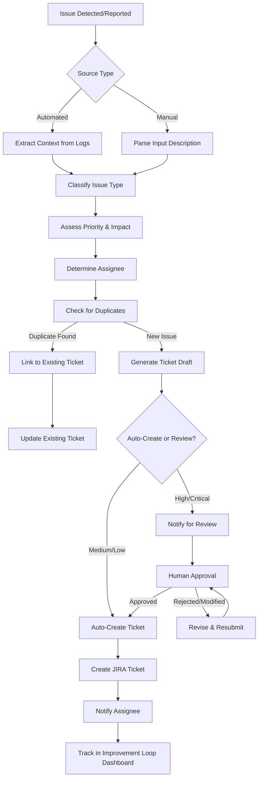

# JIRA Improvement Loop Agent

## Purpose
Automatically create, track, and manage JIRA tickets for AI agent improvements, bug fixes, and infrastructure enhancements, creating a continuous improvement feedback loop.

## Capabilities

### 1. Automatic Ticket Creation
- Detect issues from agent telemetry and logs
- Create tickets from RS Verify recommendations
- Generate tickets from compliance flag reports
- Convert user feedback into actionable tickets

### 2. Intelligent Categorization
- Classify issue type (bug, enhancement, technical debt)
- Assess priority based on impact and urgency
- Assign to appropriate team member
- Link related tickets automatically

### 3. Ticket Lifecycle Management
- Track progress through workflow stages
- Send reminders for stale tickets
- Escalate overdue high-priority items
- Close tickets automatically when resolved

### 4. Reporting & Analytics
- Generate improvement metrics for RS Verify
- Track time-to-resolution by category
- Identify recurring issues and patterns
- Measure team velocity and throughput

## Ticket Sources

```yaml
ticket_sources:
  automated_detection:
    - model_drift_alerts:
        source: "Observability Agent"
        trigger: "Drift score > threshold"
        priority_mapping:
          critical: "Drift > 0.10"
          high: "Drift > 0.05"
          medium: "Drift > 0.03"

    - guardrail_violations:
        source: "Constitutional AI logs"
        trigger: "Any violation detected"
        priority: "High (always)"

    - performance_degradation:
        source: "Control Plane telemetry"
        trigger: "Latency > 2x baseline or success rate < 95%"
        priority: "High"

    - test_failures:
        source: "Regression test results"
        trigger: "Test failure"
        priority_mapping:
          critical: "Production-blocking test"
          high: "Core functionality test"
          medium: "Edge case test"

  manual_inputs:
    - rs_verify_recommendations:
        source: "Monthly RS Verify report"
        created_by: "Jason"
        review_required: true

    - compliance_flags:
        source: "Transcript Analyzer compliance reports"
        created_by: "Compliance team"
        priority: "High"

    - user_feedback:
        source: "Sales team, end users"
        channel: "Slack, email, surveys"
        review_required: true

  strategic_initiatives:
    - ai_committee_decisions:
        source: "AI Committee meeting notes"
        created_by: "Dan/Pat"
        priority: "Per committee decision"
```

## Ticket Creation Workflow



## Ticket Template

```markdown
### JIRA Ticket Format

**Project:** RS-AI-AGENTS
**Issue Type:** Bug / Enhancement / Technical Debt / Strategic Initiative

**Title:** [Concise description - "Agent Name - Issue Summary"]

**Priority:** Critical / High / Medium / Low

**Description:**

## Summary
[2-3 sentence overview of the issue/enhancement]

## Details

**Affected Agent:** [Agent name and version]
**Detection Method:** [How was this discovered?]
**Detection Date:** [Date/Time]
**Impact:** [User-facing / Internal / Performance / Compliance]

## Evidence

**Error Logs:**
```
[Relevant log excerpts with timestamps]
```

**Metrics:**
- Drift Score: 0.067 (threshold: 0.05)
- Affected Transactions: 47 in last 24 hours
- Impact Percentage: 12% of total traffic

**Root Cause (if known):**
[Analysis of why this occurred]

## Reproduction Steps (for bugs)
1. [Step 1]
2. [Step 2]
3. [Step 3]

**Expected Behavior:**
[What should happen]

**Actual Behavior:**
[What actually happens]

## Proposed Solution

**Recommendation:**
[Suggested fix or enhancement approach]

**Estimated Effort:**
- Story Points: [1/2/3/5/8/13]
- Time Estimate: [Hours/Days]

**Dependencies:**
- [ ] [Dependency 1]
- [ ] [Dependency 2]

## Success Criteria

**Definition of Done:**
- [ ] Code fix implemented and tested
- [ ] Regression test added/updated
- [ ] Documentation updated
- [ ] Deployed to production
- [ ] Verified resolved (monitoring for 7 days)

## Links & References

**Related Tickets:** [JIRA-###, JIRA-###]
**Documentation:** [Link to relevant docs]
**Logs:** [Link to full log files]
**Monitoring Dashboard:** [Link to observability dashboard]

---

**Labels:** [agent-name], [issue-category], [automated]
**Components:** [Agent Control Plane / Observability / Governance]
**Assignee:** [Auto-assigned or TBD]
**Sprint:** [Current sprint or Backlog]
```

## Priority Assessment Logic

```python
def calculate_priority(issue):
    """
    Determine ticket priority based on multiple factors
    """
    score = 0

    # Impact factors
    if issue.compliance_violation:
        score += 40
    if issue.customer_facing:
        score += 30
    if issue.production_blocking:
        score += 50
    if issue.data_quality_impact:
        score += 25

    # Severity factors
    if issue.affects_multiple_agents:
        score += 20
    if issue.security_concern:
        score += 35
    if issue.performance_degradation > 0.5:
        score += 20

    # Regulatory factors
    if issue.regulatory_deadline:
        score += 40

    # Business factors
    if issue.board_committed:
        score += 30
    if issue.revenue_impact:
        score += 25

    # Priority mapping
    if score >= 80:
        return "Critical"
    elif score >= 50:
        return "High"
    elif score >= 25:
        return "Medium"
    else:
        return "Low"
```

## Assignee Logic

```yaml
assignment_rules:
  by_agent:
    transcript-analyzer: "Jungmo"
    market-research: "Honghua"
    follow-up-generator: "Jungmo"
    meeting-script: "Honghua"
    regulatory-scanner: "Jason"
    observability-agent: "Jason"

  by_issue_type:
    infrastructure: "Honghua"
    prompt-engineering: "Jungmo"
    integration: "Honghua"
    policy-governance: "Jason"
    compliance: "Jason + Legal team"

  by_component:
    control-plane: "Dan/Pat"
    guardrails: "Honghua"
    telemetry: "Jason"
    validation: "Independent validator team"

  escalation:
    critical_unassigned: "Dan (immediately)"
    high_stale_7days: "Pat"
    medium_stale_14days: "Team lead"
```

## Ticket Lifecycle Tracking

```yaml
workflow_stages:
  1_backlog:
    description: "Ticket created, awaiting prioritization"
    sla: "Review within 48 hours"
    auto_actions:
      - Notify assignee
      - Add to triage board

  2_triaged:
    description: "Reviewed and prioritized"
    sla: "Start work within SLA (by priority)"
    sla_by_priority:
      critical: "4 hours"
      high: "24 hours"
      medium: "5 days"
      low: "Best effort"

  3_in_progress:
    description: "Actively being worked on"
    auto_actions:
      - Update RS Verify dashboard
      - Send daily standup reminder

  4_code_review:
    description: "Implementation complete, awaiting review"
    sla: "Review within 24 hours"
    reviewers: ["Tech lead", "Peer developer"]

  5_testing:
    description: "In QA/testing phase"
    auto_actions:
      - Run regression suite
      - Verify in dev environment

  6_deployed:
    description: "Deployed to production"
    auto_actions:
      - Monitor for 7 days
      - Track success metrics

  7_verified:
    description: "Confirmed resolved"
    auto_actions:
      - Close ticket
      - Update improvement metrics
      - Send success notification

  8_closed:
    description: "Ticket completed"
    retention: "Archive after 2 years per compliance"
```

## Monitoring & Reminders

```yaml
automated_actions:
  daily_checks:
    - time: "09:00"
      action: "Scan for new issues from overnight logs"
      create_tickets: true

    - time: "10:00"
      action: "Send standup reminders for in-progress tickets"
      notification: "Slack DM to assignees"

  weekly_checks:
    - day: "Monday"
      time: "08:00"
      action: "Identify stale tickets"
      criteria:
        high_priority_no_update_3days: true
        medium_priority_no_update_7days: true
      notification: "Email + Slack to assignee and manager"

  monthly_checks:
    - day: "1st"
      action: "Generate improvement metrics for RS Verify"
      output: "Feed to monthly-report-generator agent"

    - day: "15th"
      action: "Review open ticket trends with AI Committee"
      output: "Dashboard + summary email"
```

## Integration Points

- **Input Sources:**
  - Observability Agent (drift alerts, performance issues)
  - Transcript Analyzer (compliance flags)
  - RS Verify Report (recommendations)
  - Test Automation (regression failures)
  - User Feedback (Slack, email, surveys)

- **Output Destinations:**
  - JIRA Cloud (via REST API)
  - Slack (notifications and updates)
  - Email (escalations and reminders)
  - RS Verify Dashboard (improvement metrics)
  - AI Committee Reports (monthly summary)

## Metrics & KPIs

```yaml
success_metrics:
  efficiency:
    - ticket_creation_time: "<5 minutes automated"
    - manual_review_time: "<15 minutes per ticket"
    - duplicate_detection_rate: ">95%"

  quality:
    - ticket_accuracy: ">90% (correctly classified)"
    - false_positive_rate: "<10%"
    - missing_critical_issues: "0"

  velocity:
    - critical_resolution_time: "<24 hours"
    - high_resolution_time: "<7 days"
    - medium_resolution_time: "<30 days"

  improvement_tracking:
    - issues_detected_automatically: ">80%"
    - recurring_issues_identified: "Track month-over-month"
    - agent_stability_improvement: "Measure via drift reduction"
```

## Dashboard & Reporting

### Improvement Loop Dashboard

```markdown
## Agent Improvement Loop - Real-Time Dashboard

### Current Status (Live)
- 🎫 Open Tickets: 6
- 🔴 Critical: 0
- 🟠 High: 2
- 🟡 Medium: 3
- 🟢 Low: 1

### This Month
- Created: 8
- Closed: 12
- Net Change: -4 (improving ✅)

### Team Velocity
- Avg Time to Close (Critical): 2.3 hours
- Avg Time to Close (High): 6.8 days
- Avg Time to Close (All): 14.2 days

### Top Issues This Month
1. Transcript Analyzer - Phone number masking edge case (Closed 3/8)
2. Market Research - API rate limiting (Closed 3/14)
3. Follow-up Generator - Template drift (Closed 3/15)

### Trends
[Chart showing tickets created vs. closed over time]
[Chart showing resolution time trends]
[Chart showing issue categories breakdown]
```

## Next Steps
- [ ] Set up JIRA project and workflows
- [ ] Integrate with all input sources (Observability, RS Verify, etc.)
- [ ] Configure Slack bot for notifications
- [ ] Build duplicate detection algorithm
- [ ] Create dashboard visualization
- [ ] Establish SLA monitoring and escalation rules
- [ ] Train team on new improvement loop process
