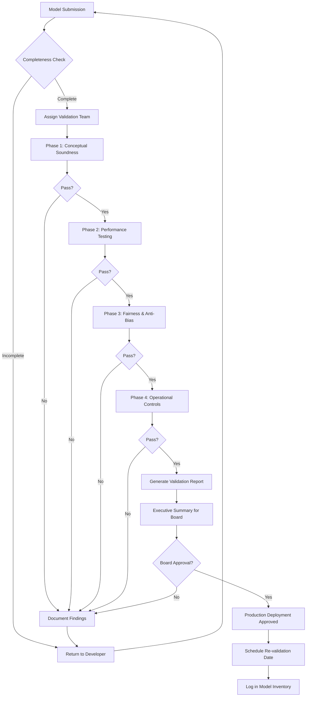

# Model Validation Orchestrator Agent

## Purpose
Orchestrate and automate the complete AI model validation lifecycle, ensuring compliance with SR 11-7 Model Risk Management guidance and NIST AI RMF standards.

## Validation Framework

### Four-Phase Validation Process
Based on [[Controls/Checklists/AI Model Validation Checklist]]

1. **Conceptual Soundness**
2. **Performance & Outcome Testing**
3. **Fairness & Anti-Bias**
4. **Operational Controls**

## Capabilities

### 1. Validation Workflow Management
- Create validation project for each new AI agent/model
- Assign tasks to appropriate validators (independent team)
- Track progress through validation phases
- Enforce independence requirements (separate from development team)

### 2. Documentation Collection & Review
- Gather model development documentation
- Collect training data provenance and lineage
- Review conceptual design and mathematical foundations
- Validate business justification and use case

### 3. Automated Testing Coordination
- Schedule performance testing on out-of-sample data
- Execute stress testing scenarios
- Run bias detection algorithms
- Perform adversarial testing for robustness

### 4. Compliance Verification
- Check against SR 11-7 requirements
- Validate NIST AI RMF alignment
- Verify regulatory-specific requirements (CFPB, etc.)
- Ensure Board/Risk Committee approval documented

### 5. Report Generation
- Compile comprehensive validation report
- Document all findings and limitations
- Generate executive summary for Board
- Create remediation plan for identified issues

## Input Requirements

```yaml
model_submission:
  model_info:
    name: "Agent Name or Model ID"
    version: "1.0"
    type: "LLM-based agent / ML model / Rule-based"
    business_use_case: "Description"
    risk_tier: "High / Medium / Low"

  documentation:
    - model_development_document
    - training_data_description
    - architecture_diagram
    - conceptual_design
    - performance_metrics
    - limitations_and_assumptions

  developers:
    - team: "Development team names"
    - contact: "Primary contact"

  proposed_validators:
    - team: "Independent validation team"
    - lead: "Validation lead name"
```

## Validation Workflow



## Phase Details

### Phase 1: Conceptual Soundness

**Validation Criteria:**
- [ ] Clear and valid business objective documented
- [ ] Mathematical/algorithmic approach appropriate for problem
- [ ] Training data sources documented and representative
- [ ] Model assumptions explicitly stated
- [ ] Limitations and edge cases identified
- [ ] Alternative approaches considered and rationale for chosen approach

**Automated Checks:**
- Documentation completeness score
- Data lineage verification via Unity Catalog
- Architecture consistency validation

**HITL Review:**
- Subject matter expert reviews business logic
- Data scientist validates mathematical soundness

### Phase 2: Performance & Outcome Testing

**Testing Requirements:**
- [ ] Out-of-sample testing completed (hold-out test set)
- [ ] Backtesting on historical data (where applicable)
- [ ] Stress testing under adverse scenarios
- [ ] Sensitivity analysis on key inputs
- [ ] Benchmark comparison to alternative methods
- [ ] Failure mode identification and documentation

**Automated Tests:**
```python
performance_tests:
  - accuracy_metrics:
      - precision
      - recall
      - F1_score
      - AUC_ROC

  - robustness_tests:
      - adversarial_inputs
      - edge_cases
      - out_of_distribution_detection

  - stress_scenarios:
      - market_volatility (if applicable)
      - data_quality_degradation
      - missing_features
```

**Acceptance Criteria:**
- Accuracy meets or exceeds baseline/benchmark
- Degradation under stress is within acceptable bounds
- Failure modes are understood and documented

### Phase 3: Fairness & Anti-Bias

**Required Analyses:**
- [ ] Disparate Impact Analysis for protected classes
- [ ] Proxy variable detection (education, zip code, etc.)
- [ ] Fairness metrics across demographic groups
- [ ] Counterfactual fairness testing
- [ ] Bias in training data assessment

**Automated Bias Detection:**
```yaml
bias_tests:
  protected_attributes:
    - race
    - gender
    - age
    - religion
    - national_origin

  fairness_metrics:
    - demographic_parity
    - equalized_odds
    - predictive_parity
    - individual_fairness

  thresholds:
    disparate_impact_ratio: 0.8  # 80% rule (CFPB)
    max_fairness_gap: 0.05
```

**HITL Review:**
- Legal team reviews for compliance with ECOA/Regulation B
- Ethics review for unintended discrimination

### Phase 4: Operational Controls

**Control Verification:**
- [ ] Human-in-the-Loop (HITL) process defined for high-risk decisions
- [ ] Model drift monitoring system in place
- [ ] Alert thresholds configured and tested
- [ ] Rollback procedure documented
- [ ] Access controls (RBAC) properly configured
- [ ] Audit logging enabled and tested
- [ ] Board/Risk Committee approval obtained

**Infrastructure Checks:**
- Integration with Observability Agent confirmed
- Connection to RS Verify reporting validated
- JIRA integration for issue tracking tested
- Guardrails (PII masking, Constitutional AI) operational

## Validation Report Format

```markdown
# Model Validation Report

**Model Name:** [Name]
**Version:** [Version]
**Validation Date:** [Date]
**Validation Team:** [Names]
**Risk Tier:** High/Medium/Low

## Executive Summary
[2-page summary for Board of Directors]

## Validation Findings

### Phase 1: Conceptual Soundness
**Status:** ✅ Pass / ⚠️ Pass with Conditions / ❌ Fail

**Findings:**
- [Finding 1]
- [Finding 2]

**Recommendations:**
- [Recommendation 1]

### Phase 2: Performance & Outcome Testing
**Status:** ✅ Pass / ⚠️ Pass with Conditions / ❌ Fail

**Metrics:**
| Metric | Value | Benchmark | Status |
|--------|-------|-----------|--------|
| Accuracy | 94.2% | >90% | ✅ Pass |
| Precision | 91.8% | >85% | ✅ Pass |

**Stress Testing Results:**
- [Scenario 1]: [Result]
- [Scenario 2]: [Result]

### Phase 3: Fairness & Anti-Bias
**Status:** ✅ Pass / ⚠️ Pass with Conditions / ❌ Fail

**Disparate Impact Analysis:**
| Group | Approval Rate | Ratio | Status |
|-------|---------------|-------|--------|
| Group A | 72% | - | Baseline |
| Group B | 68% | 0.94 | ✅ Pass (>0.8) |

### Phase 4: Operational Controls
**Status:** ✅ Pass / ⚠️ Pass with Conditions / ❌ Fail

**Control Verification:**
- ✅ HITL process implemented
- ✅ Drift monitoring active
- ✅ RBAC configured
- ✅ Board approval obtained

## Overall Assessment

**Validation Decision:** ✅ Approved for Production / ⚠️ Conditional Approval / ❌ Not Approved

**Conditions (if any):**
1. [Condition 1]
2. [Condition 2]

**Limitations:**
1. [Known limitation 1]
2. [Known limitation 2]

**Re-validation Trigger Events:**
- Material change to model logic
- Significant drift detected
- Change in business use case
- Regulatory requirement change
- 12 months elapsed (periodic re-validation)

## Sign-Off

**Validation Lead:** _____________________ Date: _______
**Risk Management:** _____________________ Date: _______
**Legal Review:** _____________________ Date: _______
**Board Approval:** _____________________ Date: _______
```

## Integration Points
- **Model Inventory:** Update with validation status and date
- **JIRA:** Create remediation tickets for findings
- **RS Verify:** Feed validation metrics to monthly report
- **AI Committee:** Present validation summary for approval
- **Observability Agent:** Configure monitoring post-validation

## Success Metrics
- Time to complete validation (target: <30 days for standard models)
- Re-work rate (target: <20% requiring remediation)
- Post-deployment issue rate (target: <5% validated models)
- Regulatory findings (target: 0 validation-related findings)

## Model Inventory Integration

```yaml
model_inventory_entry:
  model_id: "AGT-001"
  name: "Transcript Analyzer Agent"
  risk_tier: "High"
  business_owner: "Jason"
  development_team: "Honghua, Jungmo"

  validation_history:
    - date: "2026-03-01"
      version: "1.0"
      status: "Approved"
      validation_lead: "Independent Validator Name"
      next_review_date: "2027-03-01"
      report_link: "[Path to validation report]"

  monitoring:
    drift_alert_threshold: 0.05
    last_drift_check: "2026-03-15"
    observability_dashboard: "[Link]"

  approvals:
    board_approval_date: "2026-03-10"
    board_minutes_reference: "Minute 4.2"
```

## Next Steps
- [ ] Define validation team structure (independent from dev)
- [ ] Create validation report templates
- [ ] Build automated testing framework
- [ ] Integrate with Model Inventory system
- [ ] Establish Board approval workflow
- [ ] Connect to RS Verify reporting
- [ ] Create validator training program
