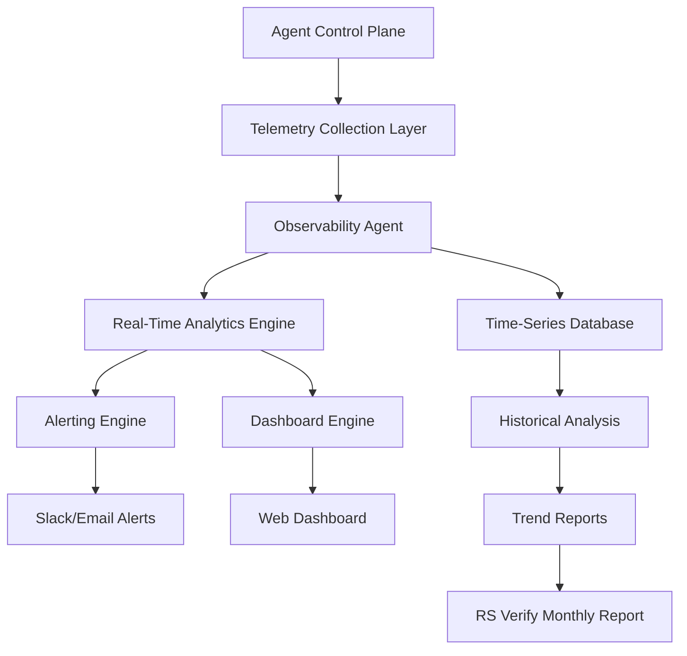
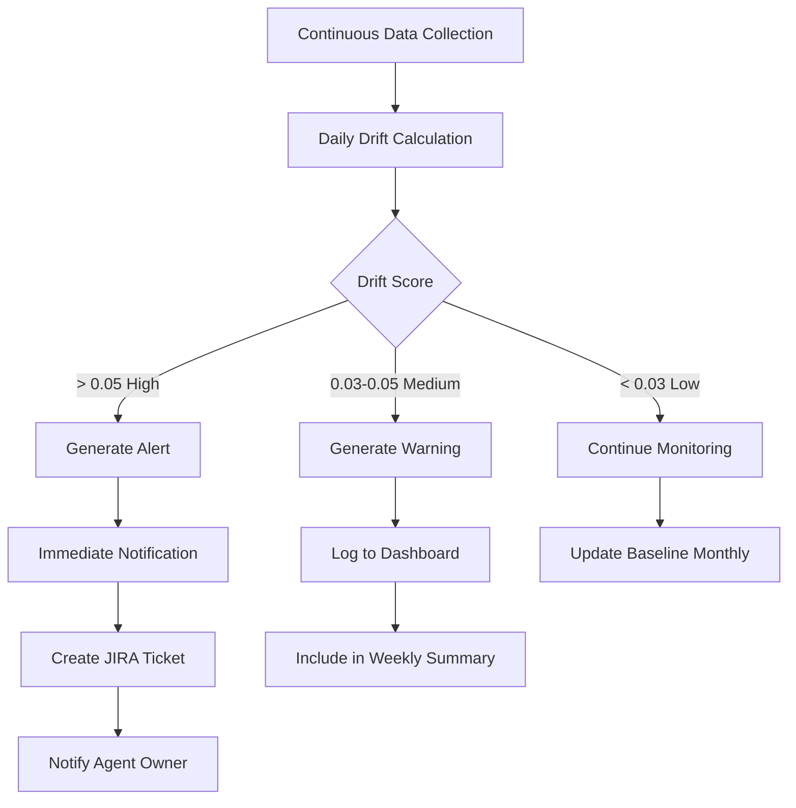

# Deployment Transparency Monitor (Observability Agent)

## Purpose
Provide real-time monitoring, transparency, and observability across all AI agents in the Control Plane, ensuring deployment health, detecting anomalies, and maintaining audit trails.

## Core Capabilities

### 1. Real-Time Health Monitoring
- Track agent uptime and availability
- Monitor response times and latency
- Detect service degradation
- Alert on failures or anomalies

### 2. Model Drift Detection
- Continuous statistical monitoring
- Compare current vs. baseline distributions
- Track accuracy degradation over time
- Generate drift scores and alerts

### 3. Resource Utilization Tracking
- Token usage by agent and user
- Memory and compute utilization
- API rate limit monitoring
- Cost tracking and forecasting

### 4. Transparency & Audit
- Complete request/response logging
- Reasoning chain capture
- Data lineage tracking
- Compliance audit trails

## Monitoring Architecture



## Telemetry Data Collection

```yaml
collected_metrics:
  performance:
    - metric: "response_latency_ms"
      type: "histogram"
      labels: ["agent_name", "user_id", "request_type"]
      retention: "90 days"

    - metric: "success_rate"
      type: "gauge"
      labels: ["agent_name", "error_type"]
      retention: "90 days"

    - metric: "throughput_requests_per_second"
      type: "counter"
      labels: ["agent_name"]
      retention: "90 days"

  resource_utilization:
    - metric: "token_usage"
      type: "counter"
      labels: ["agent_name", "model", "user_id"]
      retention: "2 years" # Compliance requirement

    - metric: "memory_usage_mb"
      type: "gauge"
      labels: ["agent_name", "instance_id"]
      retention: "30 days"

    - metric: "cost_usd"
      type: "counter"
      labels: ["agent_name", "model", "cost_type"]
      retention: "2 years" # Financial requirement

  model_behavior:
    - metric: "prediction_distribution"
      type: "histogram"
      labels: ["agent_name", "output_category"]
      retention: "90 days"

    - metric: "input_feature_distribution"
      type: "histogram"
      labels: ["agent_name", "feature_name"]
      retention: "90 days"

    - metric: "drift_score"
      type: "gauge"
      labels: ["agent_name", "drift_type"]
      retention: "2 years" # Compliance requirement

  compliance:
    - metric: "pii_masking_events"
      type: "counter"
      labels: ["agent_name", "pii_type"]
      retention: "2 years"

    - metric: "guardrail_violations"
      type: "counter"
      labels: ["agent_name", "violation_type", "severity"]
      retention: "2 years"

    - metric: "audit_log_writes"
      type: "counter"
      labels: ["agent_name", "log_type"]
      retention: "2 years"

  business:
    - metric: "user_satisfaction_score"
      type: "gauge"
      labels: ["agent_name", "user_id"]
      retention: "1 year"

    - metric: "task_completion_rate"
      type: "gauge"
      labels: ["agent_name", "task_type"]
      retention: "1 year"
```

## Model Drift Detection

### Statistical Methods

```python
drift_detection_methods = {
    "kolmogorov_smirnov": {
        "description": "Compares input feature distributions",
        "threshold": 0.05,  # p-value
        "sensitivity": "High"
    },

    "population_stability_index": {
        "description": "Measures distribution shift",
        "thresholds": {
            "low": 0.10,    # Monitor
            "medium": 0.25,  # Investigate
            "high": 0.50     # Alert
        }
    },

    "jensen_shannon_divergence": {
        "description": "Measures difference between probability distributions",
        "threshold": 0.10,
        "use_case": "Output distribution monitoring"
    },

    "performance_degradation": {
        "description": "Tracks accuracy/F1 drop",
        "thresholds": {
            "warning": 0.03,   # 3% drop
            "critical": 0.05   # 5% drop
        }
    }
}
```

### Drift Monitoring Workflow



## Alert Configuration

```yaml
alert_rules:
  critical_alerts:
    - name: "Agent Down"
      condition: "success_rate < 0.5 for 5 minutes"
      action: "Immediate Slack + Email + PagerDuty"
      recipients: ["Dan", "Pat", "Honghua", "Jungmo"]

    - name: "High Drift Detected"
      condition: "drift_score > 0.10"
      action: "Immediate Slack + Create JIRA ticket"
      recipients: ["Agent owner", "Jason"]

    - name: "Guardrail Violation"
      condition: "Any guardrail violation detected"
      action: "Immediate Slack + Email to compliance"
      recipients: ["Jason", "Dan", "Compliance team"]

    - name: "Cost Spike"
      condition: "Daily cost > 2x 7-day average"
      action: "Email alert"
      recipients: ["Jason", "Finance team"]

  warning_alerts:
    - name: "Elevated Latency"
      condition: "p95_latency > 2x baseline for 15 minutes"
      action: "Slack notification"
      recipients: ["Agent owner", "Jason"]

    - name: "Medium Drift"
      condition: "drift_score > 0.05"
      action: "Daily summary email"
      recipients: ["Agent owner"]

    - name: "Test Failure"
      condition: "Regression test fails"
      action: "Email + JIRA ticket"
      recipients: ["Developer", "QA lead"]

    - name: "Resource Utilization High"
      condition: "Token usage > 80% of quota"
      action: "Slack notification"
      recipients: ["Agent owner", "Jason"]

  informational:
    - name: "Daily Health Report"
      schedule: "Daily at 8:00 AM"
      content: "Summary of all agent health metrics"
      recipients: ["AI Committee"]

    - name: "Weekly Trend Report"
      schedule: "Monday at 9:00 AM"
      content: "Week-over-week comparison"
      recipients: ["AI Committee", "Engineering team"]
```

## Dashboard Views

### Executive Dashboard

```markdown
## Agent Control Plane - Executive View

### Overall Health: 🟢 Healthy (94/100)

| Agent | Status | Uptime | Drift | Cost |
|-------|--------|--------|-------|------|
| Transcript Analyzer | 🟢 | 99.8% | 0.02 | $36 |
| Market Research | 🟢 | 99.6% | 0.03 | $19 |
| Follow-up Generator | 🟢 | 99.9% | 0.01 | $13 |
| Meeting Script | 🟡 | 98.2% | 0.04 | $8 |

### Key Metrics (Last 24 Hours)
- Total Requests: 4,247
- Avg Response Time: 342ms
- Success Rate: 98.8%
- Total Cost: $2.14

### Alerts (Last 7 Days)
- Critical: 0
- Warning: 2 (both resolved)
- Info: 14

### Trends
[Chart: Request volume over time]
[Chart: Cost trend over time]
[Chart: Success rate trend]
```

### Technical Dashboard

```markdown
## Agent Control Plane - Technical View

### Agent: Transcript Analyzer

#### Performance (Last Hour)
- Requests: 147
- P50 Latency: 278ms
- P95 Latency: 1,024ms
- P99 Latency: 2,341ms
- Success Rate: 99.3%
- Error Rate: 0.7% (1 error: rate limit)

#### Resource Utilization
- Tokens/Request: 8,234 avg
- Memory: 2.4 GB
- CPU: 42%
- Queue Depth: 3

#### Model Behavior
[Chart: Input token distribution]
[Chart: Output length distribution]
[Chart: Confidence score distribution]

#### Drift Monitoring
- Current Drift Score: 0.023
- Trend: Stable (↔️)
- Last Baseline Update: 3/15/2026
- Next Scheduled Update: 4/15/2026

[Chart: Drift score over 30 days]

#### Recent Errors (Last 24h)
| Time | Type | Message | Count |
|------|------|---------|-------|
| 14:32 | RateLimit | OpenAI rate limit exceeded | 1 |

#### Top Users (Token Usage)
1. user@example.com - 124K tokens
2. user2@example.com - 89K tokens
3. user3@example.com - 67K tokens
```

### Compliance Dashboard

```markdown
## Compliance & Audit View

### Audit Log Health
- ✅ Completeness: 100%
- ✅ Integrity: Verified
- ✅ Retention: Compliant (2 years)
- ✅ Queryability: <500ms avg

### PII Masking
- PII Patterns Detected: 1,247 (Last 30 days)
- Masking Success Rate: 100%
- False Positives: 8 (0.6%)
- Types: SSN (423), Phone (612), Email (212)

### Guardrail Status
- ✅ All guardrails operational
- Violations: 0 (Last 30 days)
- Last Test: 3/20/2026 - Passed
- Next Test: 3/27/2026

### Access Control (RBAC)
- Total Users: 24
- Active Sessions: 8
- Unauthorized Access Attempts: 0
- Last Access Review: 3/15/2026

### Compliance Events Log
| Date | Event | Severity | Status |
|------|-------|----------|--------|
| 3/20 | Audit log query test | Info | ✅ Passed |
| 3/15 | Quarterly access review | Info | ✅ Completed |
| 3/8 | PII masking edge case | Medium | ✅ Resolved |
```

## Data Lineage Tracking

```yaml
lineage_tracking:
  enabled: true
  granularity: "per-request"

  captured_data:
    input:
      - original_request
      - user_id
      - timestamp
      - request_metadata

    processing:
      - data_sources_accessed
      - transformations_applied
      - model_version_used
      - intermediate_steps

    output:
      - final_response
      - confidence_scores
      - reasoning_chain
      - sources_cited

  storage:
    database: "Unity Catalog compatible"
    retention: "2 years (compliance)"
    encryption: "At rest and in transit"
    access_control: "RBAC enforced"

  query_capabilities:
    - "Trace any output back to source data"
    - "Identify all uses of specific data source"
    - "Reconstruct full processing pipeline"
    - "Audit data access patterns"
```

## Integration Points

- **Input Sources:**
  - Agent Control Plane (all agents)
  - Backend instance logs
  - Cloud infrastructure metrics (AWS/Azure)
  - Test automation results

- **Output Destinations:**
  - Time-series database (Prometheus/InfluxDB)
  - Web dashboard (Grafana/Tableau)
  - Slack/Email for alerts
  - JIRA (via improvement-loop-agent)
  - RS Verify monthly report
  - AI Committee reports

## Success Metrics

```yaml
observability_kpis:
  coverage:
    - agents_monitored: "100% of production agents"
    - metrics_collected: ">50 per agent"
    - log_completeness: "100%"

  performance:
    - alert_latency: "<1 minute from event"
    - query_performance: "<500ms for 90% of queries"
    - dashboard_load_time: "<3 seconds"

  accuracy:
    - false_positive_rate: "<5%"
    - drift_detection_accuracy: ">95%"
    - anomaly_detection_precision: ">90%"

  reliability:
    - observability_uptime: ">99.9%"
    - data_loss: "0%"
    - alert_delivery_success: ">99.5%"
```

## Next Steps
- [ ] Select and configure time-series database
- [ ] Build dashboard templates (executive, technical, compliance)
- [ ] Implement drift detection algorithms
- [ ] Configure alert rules and notification channels
- [ ] Set up data lineage tracking infrastructure
- [ ] Integrate with JIRA for automatic ticket creation
- [ ] Create observability runbooks for on-call
- [ ] Train team on dashboard usage and alert response
