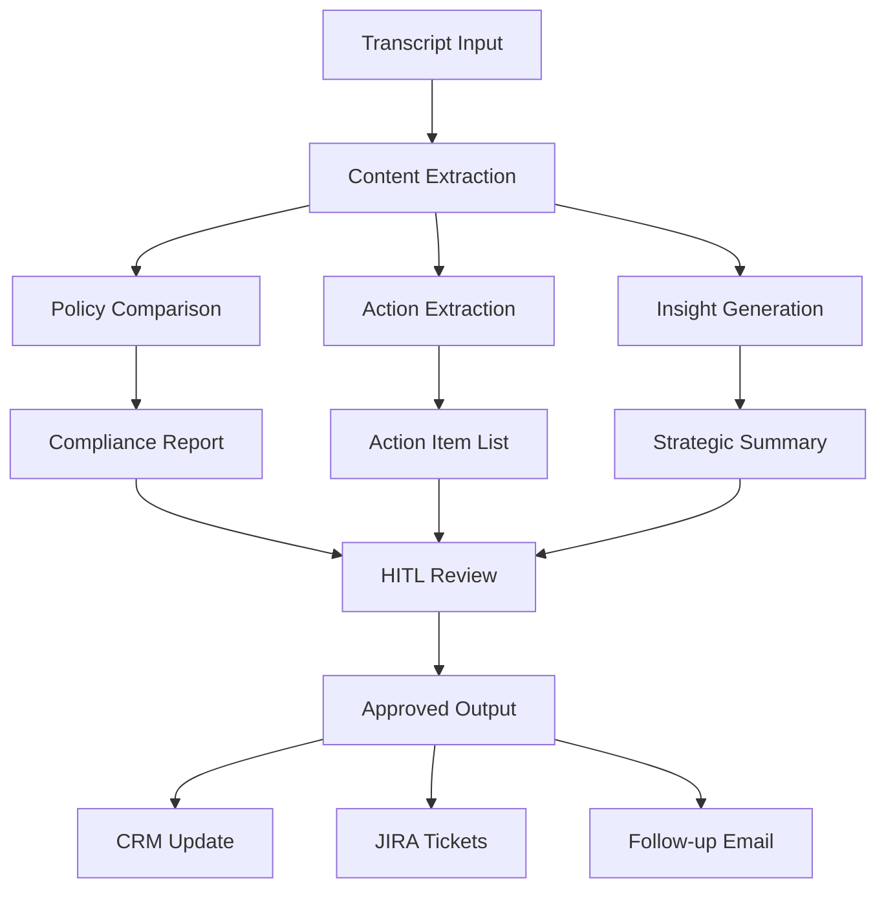

# Transcript Analyzer Agent

## Purpose
Automatically process meeting transcripts to synthesize insights, extract action items, flag compliance concerns, and generate follow-up materials.

## Capabilities

### 1. Content Analysis
- Extract key themes and discussion topics
- Identify explicit and implicit client needs
- Detect sentiment and engagement levels
- Map decision-maker attitudes and concerns

### 2. Action Item Extraction
- Identify all commitments made by team members
- Extract client requests and expectations
- Detect deadlines and timelines mentioned
- Categorize by priority and owner

### 3. Compliance & Policy Audit
- Flag statements that may conflict with company policy
- Detect unauthorized commitments or promises
- Identify potential regulatory concerns
- Check against Handwritten Rules & Policy database

### 4. Strategic Insights
- Identify unarticulated client needs
- Detect competitive threats mentioned
- Assess deal probability and risk factors
- Generate improvement suggestions for future meetings

### 5. Output Generation
- Executive summary (1 page)
- Detailed action item list with owners
- Compliance flag report
- Strategic recommendations
- Follow-up email draft

## Input Requirements
- Meeting transcript (from Zoom/Teams/recorded audio)
- Meeting metadata (participants, date, client, type)
- Policy & compliance database access
- CRM context (client history, previous meetings)

## Processing Workflow



## Output Format

### Executive Summary
```markdown
## Meeting Summary: [Client Name] - [Date]

**Participants:** [List]
**Duration:** [Time]
**Meeting Type:** Discovery / Technical / Executive

### Key Themes
1. [Theme 1 with supporting quotes]
2. [Theme 2 with supporting quotes]

### Client Needs (Explicit & Implicit)
- **Explicit:** [List with timestamps]
- **Implicit:** [Insights derived from discussion patterns]

### Sentiment Analysis
- Overall engagement: High/Medium/Low
- Decision-maker alignment: [Assessment]
- Risk factors: [List]
```

### Action Items
```yaml
action_items:
  - id: ACT-001
    owner: [Name]
    description: "[Action description]"
    deadline: [Date]
    priority: High/Medium/Low
    source: "[Transcript quote with timestamp]"
```

### Compliance Flags
```yaml
compliance_flags:
  - id: FLAG-001
    severity: High/Medium/Low
    category: Unauthorized Commitment / Policy Violation / Regulatory Risk
    description: "[What was said]"
    timestamp: "[HH:MM:SS]"
    recommendation: "[Remediation action]"
```

## Guardrails
- **Privacy:** Automatically redact PII before processing
- **HITL Required:** All compliance flags must be human-reviewed
- **Audit Trail:** Full reasoning chain logged for transparency
- **Accuracy:** Flag low-confidence insights for verification

## Integration Points
- **Input:** Zoom/Teams API for transcript retrieval
- **Policy DB:** Handwritten Rules & Policy repository
- **CRM:** Salesforce/HubSpot for client history
- **JIRA:** Automatic ticket creation for action items
- **Email:** Draft generation for follow-up communications
- **RS Verify:** Feed compliance violations to monthly report

## Success Metrics
- Time saved vs. manual meeting notes (target: 90%)
- Action item completion rate (track in JIRA)
- Compliance flag accuracy (validated by legal review)
- Client satisfaction with follow-up quality

## Version History
- v1.0 (Current): Beta testing with selected client meetings
- v0.9: Internal pilot with compliance team review
- v0.5: Initial prototype with basic extraction

## Next Steps
- [ ] Complete beta testing phase with 20 client meetings
- [ ] Integrate with JIRA-Integration agent for automatic ticketing
- [ ] Establish HITL review workflow with sales leadership
- [ ] Create dashboard for compliance flag trends
- [ ] Connect to Observability Agent for performance monitoring
