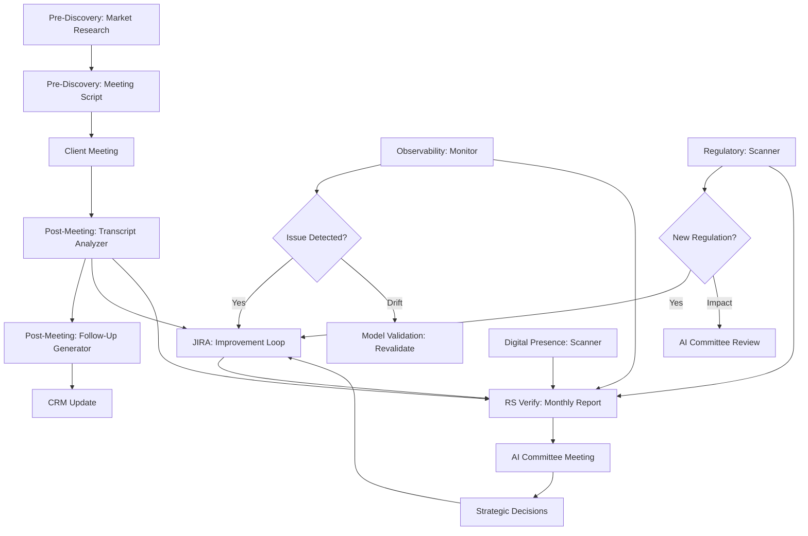

# RiskSpan AI Agent Skills Library

**Purpose:** Comprehensive library of specialized AI agent skills designed to automate workflows, ensure compliance, and provide governance across the RiskSpan AI ecosystem.

---

## 📁 Skills Directory Structure

```
Skills/
├── Pre-Discovery/                  # Client preparation automation
├── Post-Meeting-Analysis/          # Meeting transcript processing
├── Regulatory-Monitoring/          # Global regulatory compliance tracking
├── Model-Validation/               # AI model validation orchestration
├── RS-Verify-Reporting/            # Monthly reporting and analytics
├── JIRA-Integration/               # Improvement loop automation
├── Observability/                  # Real-time monitoring and transparency
├── Digital-Presence-Audit/         # Brand reputation monitoring
├── Compliance-Audit/               # Compliance checking and validation
└── Risk-Assessment/                # Risk analysis and mitigation
```

---

## 🎯 Skill Categories

### 1. Pre-Discovery Skills
**Purpose:** Automate client research and meeting preparation

| Skill | Status | Owner | Description |
|-------|--------|-------|-------------|
| [Market Research](Pre-Discovery/market-research.md) | Planned | Jason | Automated industry research and competitive analysis |
| [Meeting Script Generator](Pre-Discovery/meeting-script-generator.md) | Planned | Jason | Generate customized agendas and talking scripts |

**Key Capabilities:**
- Industry and competitive analysis
- Client intelligence gathering
- Meeting agenda and script generation
- Presentation material preparation

**Integration:** → Meeting Script Generator → Client meetings → Post-Meeting Analysis

---

### 2. Post-Meeting Analysis Skills
**Purpose:** Process meeting outcomes and generate follow-ups

| Skill | Status | Owner | Description |
|-------|--------|-------|-------------|
| [Transcript Analyzer](Post-Meeting-Analysis/transcript-analyzer.md) | Beta | Jason | Extract insights, action items, and compliance issues |
| [Follow-Up Generator](Post-Meeting-Analysis/follow-up-generator.md) | Planned | Jason | Generate personalized follow-up emails and materials |

**Key Capabilities:**
- **Three-Phase Workflow:**
  1. Data Ingestion & Synthesis
  2. Compliance & Policy Analysis
  3. Actionable Output Generation

- Content analysis and theme extraction
- Action item identification with ownership
- Compliance auditing against internal policies
- Strategic insight generation
- Follow-up email drafting

**Integration:** Transcript Analyzer → Follow-Up Generator → CRM/JIRA → RS Verify

---

### 3. Regulatory Monitoring Skills
**Purpose:** Track global regulatory changes and ensure compliance

| Skill | Status | Owner | Description |
|-------|--------|-------|-------------|
| [Global Regulator Scanner](Regulatory-Monitoring/global-regulator-scanner.md) | Planned | Jason | Monitor MAS, FSS, EU, US regulators |

**Monitored Regions:**
- 🇸🇬 **Singapore (MAS):** AI & Data Analytics guidelines
- 🇰🇷 **South Korea (FSS):** Financial AI framework
- 🇪🇺 **European Union:** EU AI Act, GDPR, MiCA, DORA
- 🇺🇸 **United States:** OCC, Fed (SR 11-7), FDIC, CFPB, SEC

**Outputs:**
- Weekly Regulatory Pulse
- Compliance Briefs for specific regulations
- Monthly executive summary
- Policy update recommendations

**Integration:** → Policy Database → JIRA (for policy updates) → AI Committee → RS Verify

---

### 4. Model Validation Skills
**Purpose:** Ensure AI models meet SR 11-7 and NIST AI RMF standards

| Skill | Status | Owner | Description |
|-------|--------|-------|-------------|
| [Validation Orchestrator](Model-Validation/validation-orchestrator.md) | Planned | Dan/Pat | Complete model validation lifecycle management |

**Four-Phase Validation:**
1. **Conceptual Soundness:** Business logic and mathematical foundations
2. **Performance Testing:** Out-of-sample accuracy, stress testing, failure modes
3. **Fairness & Anti-Bias:** Disparate impact analysis, proxy variable detection
4. **Operational Controls:** HITL, drift monitoring, RBAC, audit logging

**Outputs:**
- Comprehensive validation reports
- Board-ready executive summaries
- Model inventory updates
- Remediation plans

**Integration:** → Model Inventory → Board Approval → Observability Agent → RS Verify

---

### 5. RS Verify Reporting Skills
**Purpose:** Generate comprehensive monthly performance and compliance reports

| Skill | Status | Owner | Description |
|-------|--------|-------|-------------|
| [Monthly Report Generator](RS-Verify-Reporting/monthly-report-generator.md) | Planned | Jason | Executive and technical monthly reporting |

**Report Sections:**
1. **Infrastructure & Performance**
   - Token usage, latency, success rates
   - Cost optimization recommendations

2. **Model Integrity & Governance**
   - Drift analysis
   - Guardrail violations
   - RBAC permissions audit

3. **Digital Presence Audit**
   - 30-day LLM assessment
   - Reputation grading (A/B/C/D)

4. **Compliance & Assurance**
   - Regression test results
   - Audit log integrity
   - JIRA ticket tracking

**Integration:** Aggregates data from all agents → AI Committee → Executive Leadership → Archive

---

### 6. JIRA Integration Skills
**Purpose:** Automate improvement tracking and ticket management

| Skill | Status | Owner | Description |
|-------|--------|-------|-------------|
| [Improvement Loop Agent](JIRA-Integration/improvement-loop-agent.md) | Planned | Honghua/Jungmo | Automated JIRA ticket creation and lifecycle management |

**Ticket Sources:**
- Automated detection (drift alerts, violations, test failures)
- RS Verify recommendations
- Compliance flags
- User feedback
- AI Committee decisions

**Capabilities:**
- Intelligent categorization and prioritization
- Automatic assignee determination
- Lifecycle tracking with SLA monitoring
- Duplicate detection
- Improvement metrics reporting

**Integration:** Receives inputs from all agents → JIRA → Team notifications → RS Verify metrics

---

### 7. Observability Skills
**Purpose:** Real-time monitoring, drift detection, and transparency

| Skill | Status | Owner | Description |
|-------|--------|-------|-------------|
| [Deployment Transparency Monitor](Observability/deployment-transparency-monitor.md) | Planned | Jason | Comprehensive observability and monitoring |

**Core Capabilities:**
- **Real-Time Health Monitoring:** Uptime, latency, success rates
- **Model Drift Detection:** Statistical analysis, alerting
- **Resource Utilization:** Token usage, cost tracking
- **Transparency & Audit:** Complete request/response logging, data lineage

**Dashboard Views:**
- Executive Dashboard (health scores, trends)
- Technical Dashboard (performance metrics, errors)
- Compliance Dashboard (audit logs, PII masking, guardrails)

**Alert Levels:**
- 🔴 **Critical:** Agent down, high drift, guardrail violations, cost spikes
- 🟡 **Warning:** Elevated latency, medium drift, test failures
- ℹ️ **Info:** Daily/weekly health reports, trend summaries

**Integration:** Monitors all agents → Alert routing → JIRA → RS Verify → Dashboards

---

### 8. Digital Presence Audit Skills
**Purpose:** Monitor and improve company reputation across LLMs

| Skill | Status | Owner | Description |
|-------|--------|-------|-------------|
| [LLM Reputation Scanner](Digital-Presence-Audit/llm-reputation-scanner.md) | Planned | Jason | Audit top LLMs with 21 standardized questions |

**Monitored LLMs:**
- ChatGPT-4 (OpenAI)
- Claude Sonnet 3.5 (Anthropic)
- Gemini Pro (Google)
- Llama 3.1 (Meta)
- Grok 2 (xAI)

**21-Question Framework:**
1. **Company Basics** (5 questions): Core business, location, history
2. **Products & Services** (5 questions): Portfolio, AI capabilities, governance
3. **Market Position** (5 questions): Competitors, reputation, client profile
4. **Innovation & Trust** (6 questions): Recent innovations, compliance, security

**Grading System:**
- A (90-100): Excellent visibility and accuracy
- B (75-89): Good visibility with some gaps
- C (60-74): Moderate visibility, needs improvement
- D (<60): Poor visibility, significant issues

**Integration:** 30-day audit cycle → RS Verify report → AI Committee → Marketing team

---

## 🔄 Skill Interaction Map



---

## 📊 Skill Status Overview

| Status | Count | Skills |
|--------|-------|--------|
| **Production** | 0 | - |
| **Beta** | 1 | Transcript Analyzer |
| **Planned** | 9 | Market Research, Meeting Script, Follow-Up, Regulatory Scanner, Validation, RS Verify, JIRA Loop, Observability, Digital Presence |
| **Total** | 10 | - |

---

## 🎯 Implementation Roadmap

### Phase 1: Foundation (Q2 2026)
**Priority:** Critical infrastructure and monitoring
- [ ] Observability Agent (deployment transparency)
- [ ] JIRA Improvement Loop (ticket automation)
- [ ] Model Validation Orchestrator (SR 11-7 compliance)

### Phase 2: Core Workflows (Q2-Q3 2026)
**Priority:** Meeting lifecycle automation
- [ ] Transcript Analyzer (beta → production)
- [ ] Follow-Up Generator
- [ ] Market Research Agent

### Phase 3: Reporting & Compliance (Q3 2026)
**Priority:** Reporting and governance
- [ ] RS Verify Monthly Report Generator
- [ ] Regulatory Monitoring Scanner
- [ ] Digital Presence Audit

### Phase 4: Enhancement (Q4 2026)
**Priority:** Advanced capabilities
- [ ] Meeting Script Generator
- [ ] Compliance Audit Agent
- [ ] Risk Assessment Agent

---

## 🛡️ Governance & Standards

### All Skills Must Comply With:

1. **[[Internal/Control-Plane/Handwritten-Rules-Policy|Handwritten Rules & Policy]]**
   - Enterprise-level instance with RBAC
   - All telemetry persisted in backend
   - Documented sign-off before production

2. **Guardrails**
   - Real-time PII masking
   - Constitutional AI policy layers
   - Human-in-the-Loop for high-risk actions

3. **Testing Requirements**
   - Regression test suite attached
   - Weekly overarching ecosystem test
   - Validation following [[Controls/Checklists/AI Model Validation Checklist]]

4. **Monitoring & Reporting**
   - Integration with Observability Agent
   - Monthly RS Verify inclusion
   - JIRA improvement loop connection

---

## 📈 Success Metrics

### Operational Efficiency
- **Time Saved:** Target 80-90% reduction vs. manual processes
- **Accuracy:** >95% on automated tasks
- **Uptime:** >99.5% availability for production skills

### Quality & Compliance
- **Compliance:** 0 regulatory findings related to agent operations
- **Drift:** <5% of agents triggering drift alerts monthly
- **Guardrail Violations:** Target 0 per month

### Business Impact
- **Client Satisfaction:** >4.5/5 rating on agent-assisted interactions
- **Sales Velocity:** 20% improvement in deal cycle time
- **Cost Optimization:** 15% annual savings through automation

---

## 🔗 Related Documentation

- **Framework:** [README.md](../README.md) - Main governance framework
- **Governance:** [Best Practices](../Governance/Best-Practices-AI-Banking.md)
- **Compliance:** [Regulatory Frameworks](../Governance/Frameworks/)
- **Controls:** [Validation Checklist](../Controls/Checklists/AI%20Model%20Validation%20Checklist.md)
- **Architecture:** [Control Plane](../Internal/Control-Plane/Architecture.md)
- **Policy:** [Handwritten Rules](../Internal/Control-Plane/Handwritten-Rules-Policy.md)

---

## 👥 Skill Ownership

| Owner | Responsibilities | Skills |
|-------|-----------------|---------|
| **Jason** | Strategy, Observability, Discovery | Market Research, Meeting Script, Transcript Analyzer, Follow-Up, Regulatory Scanner, Observability, Digital Presence, RS Verify |
| **Dan/Pat** | Infrastructure, Validation | Model Validation, Control Plane oversight |
| **Honghua/Jungmo** | Technical Implementation | JIRA Integration, agent development support |

---

## 📞 Contact & Support

**Questions about skills?** Contact the AI Committee:
- Strategic: Dan Kim, Pat
- Observability: Jason
- Technical: Honghua, Jungmo

**Add a new skill:**
1. Create skill definition following the template format
2. Submit for AI Committee review
3. Complete validation checklist
4. Obtain sign-off before deployment

---

**Last Updated:** March 2026
**Version:** 1.0
**Status:** Skills library under active development
