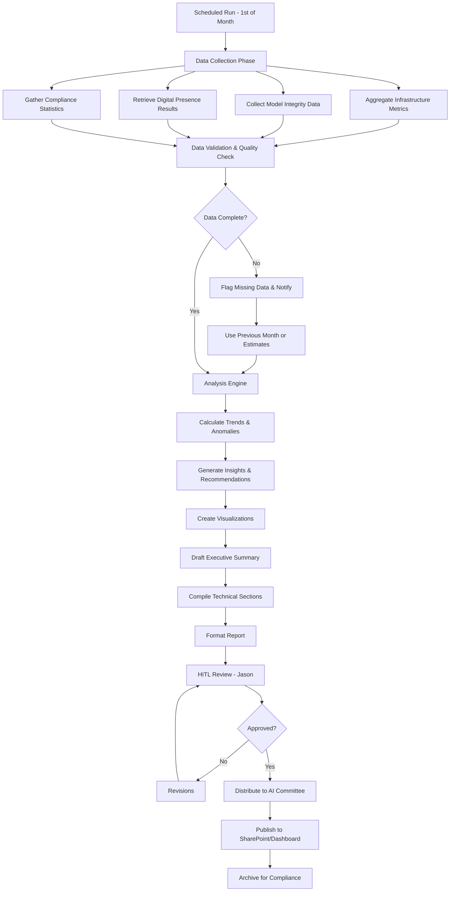

# RS Verify Monthly Report Generator

## Purpose
Automatically generate comprehensive monthly RS Verify reports providing executive and technical summaries of AI agent performance, compliance, and infrastructure health.

## Report Structure
Based on [[Governance/Reporting/RS-Verify-Monthly-Template]]

### Four Main Sections
1. Infrastructure & Performance
2. Model Integrity & Governance
3. Digital Presence Audit (30-day cycle)
4. Compliance & Assurance

## Capabilities

### 1. Data Aggregation
- Collect telemetry from Agent Control Plane
- Pull model drift metrics from Observability Agent
- Gather guardrail violation logs
- Retrieve JIRA ticket statistics
- Compile Digital Presence Audit results

### 2. Analysis & Insights
- Calculate trend analysis (month-over-month)
- Identify anomalies and outliers
- Generate cost optimization recommendations
- Assess compliance posture
- Highlight areas of concern

### 3. Visualization
- Create performance dashboards
- Generate trend charts and graphs
- Build heat maps for drift analysis
- Produce compliance scorecards

### 4. Executive Communication
- Write executive summary (1-page)
- Generate technical deep-dive sections
- Create actionable recommendations
- Provide board-ready presentations

## Data Sources

```yaml
data_sources:
  infrastructure:
    - control_plane_telemetry:
        metrics: [token_usage, latency, success_rate, uptime]
        source: "Backend logs"

    - cost_tracking:
        metrics: [monthly_spend, cost_per_agent, cost_trend]
        source: "Cloud billing API"

  model_integrity:
    - drift_monitoring:
        metrics: [drift_score, accuracy_delta, distribution_shift]
        source: "Observability Agent"

    - guardrail_violations:
        metrics: [violation_count, severity, category]
        source: "Constitutional AI logs"

    - permissions_audit:
        metrics: [rbac_compliance, access_review_status]
        source: "Identity management system"

  digital_presence:
    - llm_audit_results:
        metrics: [grade, score, response_quality]
        source: "Digital Presence Audit Agent"
        frequency: "30-day cycle"

  compliance:
    - regression_tests:
        metrics: [pass_rate, failure_count, coverage]
        source: "Test automation framework"

    - audit_logs:
        metrics: [completeness, queryability, retention]
        source: "Audit log database"

    - jira_tickets:
        metrics: [open_count, closed_count, time_to_resolution]
        source: "JIRA API"
```

## Report Generation Workflow



## Report Format

### Executive Summary (Page 1)

```markdown
# RS Verify Monthly Report
## Executive Summary

**Period:** [Month Year]
**Prepared by:** RS Verify Report Generator Agent
**Reviewed by:** [Jason]
**Distribution:** AI Committee, Executive Leadership

### 🎯 Key Highlights

**Overall Health Score: [85/100]** 🟢 Healthy / 🟡 Attention Needed / 🔴 Critical

**Month-over-Month Trends:**
- Infrastructure Performance: ⬆️ +3%
- Model Drift Risk: ⬇️ -12%
- Compliance Posture: ➡️ Stable
- Cost Efficiency: ⬆️ +8%

### 📊 Summary Metrics

| Category | This Month | Last Month | Trend | Status |
|----------|------------|------------|-------|--------|
| Token Usage | 2.4M | 2.1M | +14% | 🟢 |
| Avg Latency | 342ms | 389ms | -12% | 🟢 |
| Drift Alerts | 2 | 7 | -71% | 🟢 |
| Guardrail Violations | 0 | 1 | -100% | 🟢 |
| Digital Presence Grade | A- | B+ | +1 grade | 🟢 |

### 🚨 Items Requiring Attention
1. **[Issue if any]** - [Brief description] - Owner: [Name] - Due: [Date]
2. [None this month]

### 💡 Top 3 Recommendations
1. **Cost Optimization:** [Specific recommendation with estimated savings]
2. **Performance Enhancement:** [Specific recommendation]
3. **Policy Update:** [Specific recommendation]

### 📅 Next Month Focus
- [Priority 1]
- [Priority 2]
- [Priority 3]
```

### Section 1: Infrastructure & Performance

```markdown
## 1️⃣ Infrastructure & Performance

### Managed Backend Status
**Status:** 🟢 Running Optimally
**Uptime:** 99.97% (Target: >99.5%)
**Incidents:** 0 this month

### Token Usage Analysis

**Total Tokens:** 2,431,847
**Breakdown by Agent:**

| Agent | Tokens Used | % of Total | Cost | Trend |
|-------|-------------|------------|------|-------|
| Transcript Analyzer | 1,204,932 | 49.5% | $36.15 | ⬆️ +22% |
| Market Research | 623,148 | 25.6% | $18.69 | ⬇️ -5% |
| Follow-up Generator | 418,901 | 17.2% | $12.57 | ⬆️ +8% |
| Others | 184,866 | 7.6% | $5.55 | ➡️ Stable |

**Month-over-Month:** +14.2%
**Annual Run Rate:** $877K (vs. budget $950K) ✅

**Token Efficiency Metrics:**
- Tokens per successful transaction: 342 (Last month: 389) ⬇️ -12%
- Failed transaction rate: 1.2% (Target: <2%) ✅

### Latency & Success Rate

**Average Response Latency:**
- Overall: 342ms (Target: <500ms) ✅
- 95th percentile: 1,247ms
- 99th percentile: 2,891ms

**Success Rate:** 98.8% (Target: >98%) ✅

**Performance by Agent:**
[Bar chart showing latency distribution]

### Infrastructure Optimization Suggestions

1. **Recommendation:** Migrate low-priority internal agents to Llama-3
   - **Estimated Savings:** $12K/year (15% token cost reduction)
   - **Impact:** No change to quality for internal-only tasks
   - **Implementation Effort:** Low (2 weeks)

2. **Recommendation:** Implement prompt caching for Market Research agent
   - **Estimated Savings:** 18% token reduction on repetitive queries
   - **Impact:** Faster response times + cost savings
   - **Implementation Effort:** Medium (4 weeks)

3. **Recommendation:** Optimize Transcript Analyzer chunking strategy
   - **Estimated Savings:** 8% token reduction
   - **Impact:** Improved accuracy on long transcripts
   - **Implementation Effort:** Low (1 week)
```

### Section 2: Model Integrity & Governance

```markdown
## 2️⃣ Model Integrity & Governance

### Model Drift Analysis

**Drift Monitoring Summary:**
- Total agents monitored: 8
- Drift alerts triggered: 2 (Last month: 7) ⬇️ -71%
- Critical drift events: 0 ✅

**Agents with Drift Detected:**

| Agent | Drift Score | Severity | Root Cause | Status |
|-------|-------------|----------|------------|--------|
| Follow-up Generator | 0.047 | 🟡 Medium | Template update needed | Remediated |
| Market Research | 0.032 | 🟢 Low | Seasonal industry changes | Monitoring |

**Drift Score Distribution:**
[Heat map showing drift scores over time]

**Actions Taken:**
- Follow-up Generator: Retrained with updated templates (3/15)
- Market Research: Monitoring for Q2 industry shifts
- All other agents: Within acceptable thresholds (<0.03)

### Guardrail Violations

**Total Violations:** 0 this month ✅ (Last month: 1)

**Previous Month Incident (Resolved):**
- Agent: Transcript Analyzer
- Type: Attempted to process unmasked PII
- Severity: Medium
- Root Cause: Edge case in phone number detection
- Remediation: Updated regex patterns + added test case
- Status: Closed 3/8, re-tested successfully

**PII Masking Effectiveness:**
- PII patterns detected and masked: 1,247 instances
- False positive rate: 0.3% (8 instances manually reviewed)
- False negative rate: 0% (validated in sample audit) ✅

### Permissions Audit (RBAC)

**Audit Status:** ✅ Compliant

**Summary:**
- Total enterprise IDs: 12
- Active agent instances: 8 production + 4 dev/test
- Access reviews completed: 12/12 (100%)
- Unauthorized access attempts: 0
- Role changes: 2 (documented and approved)

**Recent Changes:**
1. New agent "Regulatory Scanner" added with Read-Only permissions to policy DB
2. Transcript Analyzer permissions updated to include CRM write access (approved by Dan 3/10)

**Next Quarterly Review:** June 1, 2026
```

### Section 3: Digital Presence Audit

```markdown
## 3️⃣ Digital Presence Audit (30-Day Cycle)

**Audit Period:** [Feb 24 - Mar 23, 2026]
**LLMs Tested:** ChatGPT-4, Claude Sonnet 3.5, Gemini Pro, Llama 3.1, Grok 2

### Overall Grade: **A-** (Last cycle: B+) ⬆️ +1 grade level

### LLM-by-LLM Results

| LLM | Grade | Score | Key Strengths | Areas for Improvement |
|-----|-------|-------|---------------|----------------------|
| ChatGPT-4 | A | 92/100 | Accurate company description, strong on AI governance | Limited detail on specific products |
| Claude Sonnet 3.5 | A | 94/100 | Excellent on governance framework | Could improve on team structure |
| Gemini Pro | B+ | 88/100 | Good on industry positioning | Outdated information on some services |
| Llama 3.1 | B | 85/100 | Accurate high-level overview | Generic responses, lacks specificity |
| Grok 2 | B+ | 87/100 | Strong on innovation aspects | Some confusion with similar company names |

### 21-Question Analysis

**Question Performance Breakdown:**
[Chart showing question categories and average scores]

**Top Performing Questions (>90% accuracy across LLMs):**
1. "What does RiskSpan do?" - 96%
2. "What industries does RiskSpan serve?" - 94%
3. "Where is RiskSpan located?" - 98%

**Questions Needing Attention (<80% accuracy):**
1. "What AI governance frameworks does RiskSpan use?" - 74%
   - **Action:** Increase public content on governance frameworks
2. "Who are RiskSpan's key competitors?" - 76%
   - **Action:** Publish competitive positioning white paper

### Trend Analysis

**Month-over-Month Changes:**
- ChatGPT improved +4 points (new press release indexed)
- Claude improved +6 points (updated website content detected)
- Gemini stable (no major changes)
- Llama stable (training data cutoff limitation)
- Grok improved +3 points (recent news coverage)

**Digital Reputation Drivers:**
1. ✅ Recent press release on AI Control Plane (indexed by 4/5 LLMs)
2. ✅ Updated LinkedIn company page (detected by ChatGPT, Claude)
3. ⚠️ Limited technical documentation publicly available
4. ⚠️ Competitor XYZ published major AI governance white paper (stealing mindshare)

### Recommendations

1. **Content Strategy:**
   - Publish AI Control Plane white paper on website
   - Create LinkedIn articles on governance best practices
   - Submit guest posts to industry publications

2. **SEO Optimization:**
   - Target keywords: "AI governance", "model risk management", "banking AI compliance"
   - Build backlinks from authoritative sources (NIST, regulatory sites)

3. **Thought Leadership:**
   - Increase executive visibility (Dan, Pat) on LinkedIn
   - Speak at industry conferences on AI governance
   - Contribute to regulatory comment periods

**Next Audit:** April 23, 2026
```

### Section 4: Compliance & Assurance

```markdown
## 4️⃣ Compliance & Assurance

### Regression Suite Results

**Weekly Regression Testing:**
- Total test runs: 4 this month
- Total test cases: 287
- Pass rate: 99.3% ✅ (Target: >98%)
- Failed tests: 2 (both resolved)

**Test Coverage by Agent:**

| Agent | Test Cases | Pass Rate | Failed Tests | Status |
|-------|------------|-----------|--------------|--------|
| Transcript Analyzer | 94 | 100% | 0 | ✅ |
| Market Research | 67 | 98.5% | 1 (fixed) | ✅ |
| Follow-up Generator | 52 | 100% | 0 | ✅ |
| Meeting Script Gen | 43 | 97.7% | 1 (fixed) | ✅ |
| Others | 31 | 100% | 0 | ✅ |

**Failed Test Details:**
1. Test: Market Research - Financial data extraction
   - Date: 3/12
   - Root Cause: API rate limit exceeded
   - Resolution: Implemented retry logic with exponential backoff
   - Re-test: Passed 3/14

2. Test: Meeting Script - Custom template rendering
   - Date: 3/19
   - Root Cause: Edge case with special characters
   - Resolution: Updated template sanitization
   - Re-test: Passed 3/20

### Audit Log Integrity

**Status:** ✅ Fully Compliant

**Metrics:**
- Log completeness: 100% (all prompts, reasoning, actions logged)
- Log retention: 100% compliance (2-year retention policy)
- Queryability: <500ms average query time ✅
- Storage used: 247 GB (45% of allocated capacity)

**Sample Audit Completed:** 3/20/2026
- Sample size: 50 random transactions
- Verification: All 50 transactions fully traceable from prompt to output
- Data integrity: 100% match between logged and actual events
- PII masking verification: All PII properly redacted in logs

### JIRA Ticket Status

**Agent Improvement Loop:**
- New tickets created: 8
- Tickets closed: 12
- Open tickets: 6 (down from 10 last month)

**Ticket Breakdown by Priority:**

| Priority | Open | Closed This Month | Avg Time to Close |
|----------|------|-------------------|-------------------|
| Critical | 0 | 1 | 2 days |
| High | 2 | 4 | 8 days |
| Medium | 3 | 5 | 15 days |
| Low | 1 | 2 | 24 days |

**Top Improvement Themes:**
1. Performance optimization (3 tickets closed)
2. Prompt engineering enhancements (4 tickets closed)
3. Integration improvements (2 tickets closed)
4. New feature requests (3 tickets open)

**Open Tickets Requiring Attention:**
1. [JIRA-456] Transcript Analyzer - Add multi-language support
   - Priority: High
   - Owner: Jungmo
   - Target: 4/15
   - Status: In Progress (75% complete)

2. [JIRA-489] Market Research - Integrate additional data sources
   - Priority: High
   - Owner: Honghua
   - Target: 4/30
   - Status: Planning (25% complete)

### Policy & Governance Updates

**Handwritten Rules Review:**
- Last review: AI Committee meeting 3/15/2026
- Changes approved: 0 (no changes needed this month)
- Next review: 4/15/2026

**Regulatory Monitoring:**
- New regulations tracked: 3
- Impact assessments completed: 3
- Policy updates required: 1 (scheduled for April)

**Details:**
1. MAS consultation on AI explainability (Reviewed 3/5)
   - Impact: Low - Already compliant
   - Action: None required

2. CFPB circular update on chatbots (Reviewed 3/18)
   - Impact: Medium - May require enhanced logging
   - Action: Impact assessment in progress

3. EU AI Act implementation timeline (Reviewed 3/22)
   - Impact: High - Will require policy updates for EU clients
   - Action: Policy update scheduled for April AI Committee meeting
```

## Distribution & Access

```yaml
distribution:
  recipients:
    ai_committee:
      - Dan Kim (Strategic Oversight)
      - Pat (Infrastructure Lead)
      - Jason (Strategy & Observability)
      - Honghua (Technical Implementation)
      - Jungmo (Technical Implementation)

    executive_leadership:
      - CEO
      - CTO
      - Chief Risk Officer
      - Chief Compliance Officer

  format:
    - PDF (for email distribution)
    - Interactive Dashboard (Tableau/Power BI)
    - SharePoint Archive (compliance retention)

  timing:
    generation_date: "1st business day of month"
    review_deadline: "3rd business day"
    distribution_date: "5th business day"
    ai_committee_review: "Monthly meeting (2nd week)"
```

## Success Metrics
- Report generation time (target: <4 hours automated)
- HITL review time (target: <2 hours)
- Actionable insights per report (target: >5)
- Recommendation implementation rate (target: >70%)
- AI Committee satisfaction score (target: >4.5/5)

## Next Steps
- [ ] Build data aggregation pipelines from all sources
- [ ] Create visualization templates and dashboards
- [ ] Establish HITL review workflow with Jason
- [ ] Integrate with AI Committee meeting scheduler
- [ ] Set up automated distribution system
- [ ] Create historical trending database
- [ ] Build predictive analytics for future months
