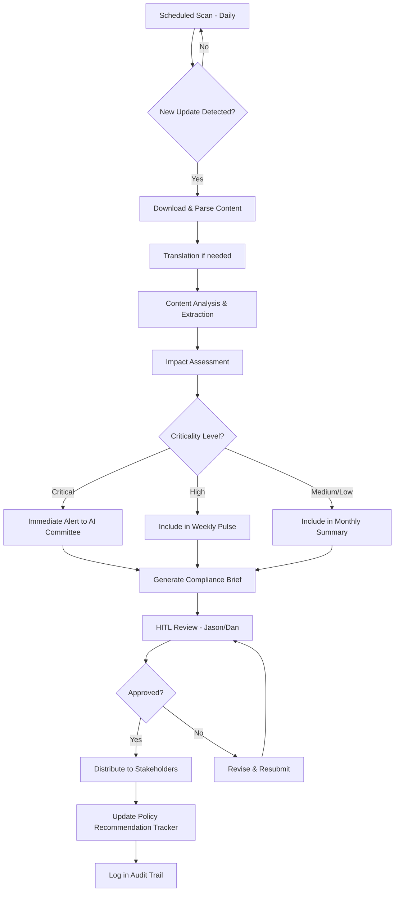

# Global Regulator Scanner Agent

## Purpose
Proactively monitor and synthesize regulatory developments from global banking and AI regulators (MAS, FSS, EU, US) to ensure internal compliance and policy alignment.

## Monitoring Scope

### Geographic Regions
1. **Singapore - MAS (Monetary Authority of Singapore)**
   - AI & Data Analytics guidelines
   - FEAT principles (Fairness, Ethics, Accountability, Transparency)
   - Digital banking regulations

2. **South Korea - FSS (Financial Supervisory Service)**
   - Financial AI regulatory framework
   - Data protection requirements
   - Fintech licensing and oversight

3. **European Union**
   - EU AI Act implementation
   - GDPR intersection with AI
   - MiCA (Markets in Crypto-Assets)
   - Digital Operational Resilience Act (DORA)

4. **United States**
   - **OCC:** Banking AI risk management
   - **Federal Reserve:** SR 11-7 updates and model risk guidance
   - **FDIC:** Third-party risk management
   - **CFPB:** AI explainability and fair lending
   - **SEC:** AI in capital markets

## Capabilities

### 1. Automated Scanning
- Monitor official regulator websites and RSS feeds
- Track legislative databases and regulatory registers
- Scan industry publications and legal bulletins
- Set up alerts for keyword-triggered updates

### 2. Content Synthesis
- Extract key requirements and deadlines
- Translate non-English regulations (Korean, EU languages)
- Identify intersection points across jurisdictions
- Map changes to internal policies and procedures

### 3. Impact Analysis
- Assess relevance to RiskSpan operations
- Identify "Top 3 Impacts" for each regulatory update
- Determine urgency level (Critical/High/Medium/Low)
- Recommend policy updates needed

### 4. Reporting & Distribution
- Generate Weekly Regulatory Pulse summary
- Create Compliance Briefs for specific regulations
- Produce monthly executive summary for AI Committee
- Trigger alerts for critical/time-sensitive updates

## Data Sources

```yaml
sources:
  singapore:
    - url: "https://www.mas.gov.sg/regulation"
    - feed: "MAS Press Releases RSS"
    - api: "MAS API (if available)"

  korea:
    - url: "https://www.fss.or.kr/eng/"
    - feed: "FSS English updates"
    - translation: "Required for Korean-language circulars"

  eu:
    - url: "https://artificialintelligenceact.eu/"
    - url: "https://eur-lex.europa.eu/"
    - feed: "EU AI Act updates"

  us_fed:
    - url: "https://www.federalreserve.gov/supervisionreg/"
    - feed: "SR Letters RSS"

  us_occ:
    - url: "https://www.occ.gov/news-issuances/"
    - feed: "OCC Bulletins RSS"

  us_cfpb:
    - url: "https://www.consumerfinance.gov/compliance/circulars/"
    - feed: "CFPB Compliance Circulars"
```

## Processing Workflow



## Output Formats

### Weekly Regulatory Pulse
```markdown
# Weekly Regulatory Pulse
**Period:** [Start Date] - [End Date]
**Prepared by:** Global Regulator Scanner Agent
**Reviewed by:** [Name]

## 🚨 Critical Updates (Immediate Action Required)
[None this week / List with details]

## 📋 New Developments by Region

### Singapore (MAS)
- **Update Title:** [Regulation/Guideline Name]
- **Date Issued:** [Date]
- **Summary:** [2-3 sentences]
- **Top 3 Impacts:**
  1. [Impact on operations]
  2. [Impact on compliance]
  3. [Impact on policy]
- **Action Required:** [Specific next steps]
- **Deadline:** [If applicable]

### [Repeat for other regions]

## 📊 Trend Analysis
- [Emerging themes across jurisdictions]
- [Convergence/divergence patterns]

## 🔄 Policy Update Recommendations
1. [[Internal/Control-Plane/Handwritten-Rules-Policy]] - [Specific change]
2. [[Governance/Best-Practices]] - [Specific addition]

## 📚 Resources & Links
- [List of full regulatory texts and analysis]
```

### Compliance Brief (for specific regulations)
```markdown
# Compliance Brief: [Regulation Name]

**Regulator:** [Authority Name]
**Issued:** [Date]
**Effective Date:** [Date]
**Criticality:** Critical/High/Medium/Low

## Executive Summary
[2-3 paragraph overview in plain language]

## Key Requirements
1. [Requirement 1 with specifics]
2. [Requirement 2 with specifics]
3. [Requirement 3 with specifics]

## RiskSpan Impact Assessment

### Affected Areas
- [ ] Agent Control Plane infrastructure
- [ ] Governance & Policy framework
- [ ] Model validation processes
- [ ] Third-party vendor management
- [ ] Client-facing services

### Top 3 Impacts
1. **[Impact Area]:** [Detailed explanation]
2. **[Impact Area]:** [Detailed explanation]
3. **[Impact Area]:** [Detailed explanation]

## Recommended Actions

### Immediate (Within 30 days)
- [ ] [Action item with owner]
- [ ] [Action item with owner]

### Near-term (Within 90 days)
- [ ] [Action item with owner]

### Strategic (6-12 months)
- [ ] [Action item with owner]

## Policy Update Recommendations
- **Document:** [[Policy Path]]
- **Proposed Change:** [Specific text or section to add/modify]
- **Rationale:** [Why this change is needed]

## Additional Resources
- [Link to full regulatory text]
- [Link to industry analysis]
- [Link to legal interpretation]
```

## Guardrails
- **Source Verification:** Only use official regulatory sources
- **Translation Accuracy:** Flag machine translations for legal review
- **Conservative Interpretation:** When in doubt, escalate to legal
- **HITL Review:** All critical updates require human verification
- **Audit Trail:** Complete provenance for every regulatory update

## Integration Points
- **Policy Database:** Handwritten Rules & Policy repository
- **JIRA:** Auto-create tickets for policy updates
- **AI Committee:** Feed into monthly meeting agenda
- **RS Verify:** Include in monthly compliance reporting
- **Observability Agent:** Alert on scanning failures or anomalies

## Success Metrics
- Regulatory update detection speed (target: within 24 hours)
- False positive rate (target: <5%)
- Translation accuracy for non-English content (validated by legal)
- Time saved vs. manual monitoring (target: 95%)
- Policy update implementation rate

## Alert Thresholds

```yaml
criticality_levels:
  critical:
    criteria:
      - Immediate compliance action required
      - Financial penalties for non-compliance
      - Deadline within 60 days
    response: Immediate email + Slack alert to AI Committee

  high:
    criteria:
      - Material impact on operations
      - Deadline within 6 months
      - Policy changes required
    response: Include in Weekly Pulse + Flag for next AI Committee meeting

  medium:
    criteria:
      - Moderate impact on operations
      - Awareness required but no immediate action
    response: Include in Weekly Pulse

  low:
    criteria:
      - Informational updates
      - Future considerations
    response: Include in Monthly Summary only
```

## Next Steps
- [ ] Define canonical list of regulatory sources
- [ ] Set up automated scanning infrastructure
- [ ] Establish translation validation process
- [ ] Create HITL review interface for Jason/Dan
- [ ] Integrate with JIRA for policy update tracking
- [ ] Connect to RS Verify reporting module
- [ ] Build dashboard for regulatory trend analysis
- [ ] Establish AI Committee review cycle
